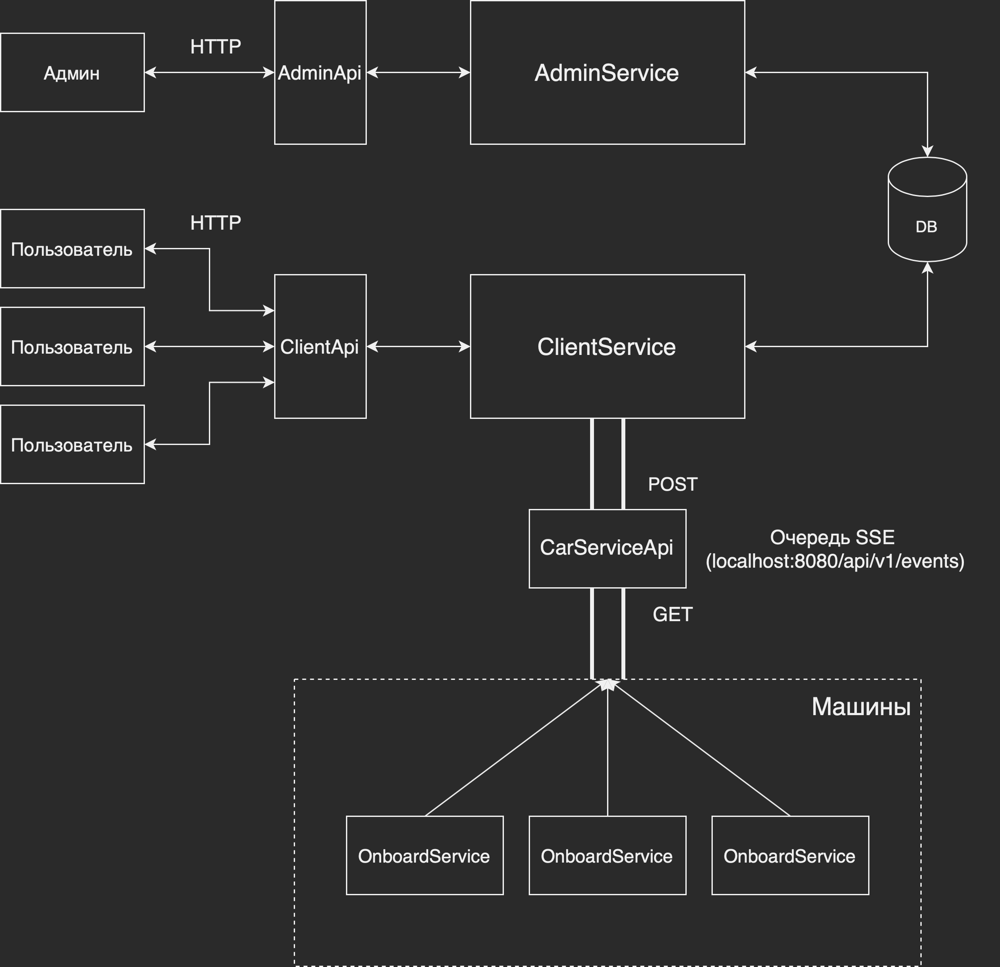

## Каршеринг

### Основные компоненты

- **ClientService.**
  Cервис с которым общаются клиенты. Предоставляет API для следующих действий:
    - поиск ближайших машин;
    - получение информации о состоянии машины;
    - занять/оставить машину.
- **OnboardService.**
  Cервис, который запускается на каждом автомобиле. Выполняет две задачи:
    - Читает сообщения о событиях пользователей (занять/оставить машину) из очереди;
    - Передает информацию о состоянии автомобиля в бд.
- **CarService**. Связывает _OnboardService_ и _ClientService_, предоставляя API для чтения из очереди и добавления
  нового сообщения в нее. Передача сообщений осуществляется по протоколу _Server-Sent Events_.
- **AdminService**. Self-explanatory.

### Архитектура
(некоторые детали упрощены)


### Запуск
Запустите CarsharingHttpApp: `sbt run`

Затем, для каждой машины:
1. Откройте отдельное окно терминала;
2. Запустите sbt: `sbt`
3. Запустите OnboardApp, передав в качестве аргумента командной строки id машины:
   `runMain com.fedosique.carsharing.OnboardApp.OnboardApp 00000000-0000-0000-0000-100000000001`

### Сущности
Состояние автомобиля представлено следующим образом:
```json
{
  "id": "b2d67fda-3ff2-411e-a7f5-b2712b8a206c",
  "name": "kia rio",
  "color": "blue",
  "plateNumber": "в123ау78",
  "location": {
    "lat": 60.78782,
    "lon": 55.8493
  },
  "status": {
    "fuel": 0.85,
    "isOccupied": true,
    "occupiedBy": "00000000-0000-0000-0000-000000000001"
  },
  "price": 10.0
}
```
Пользователь:
```json
{
  "id": "44622183-aadc-45cd-934e-8e8e86d2cc7d",
  "name": "John",
  "email": "john@gmail.com",
  "isRenting": false
}
```